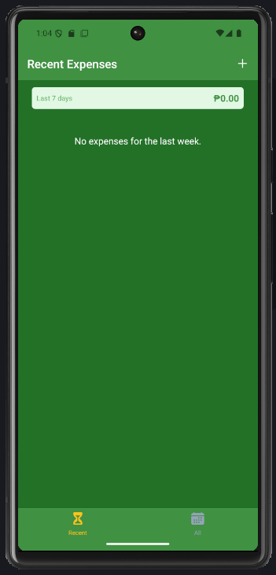
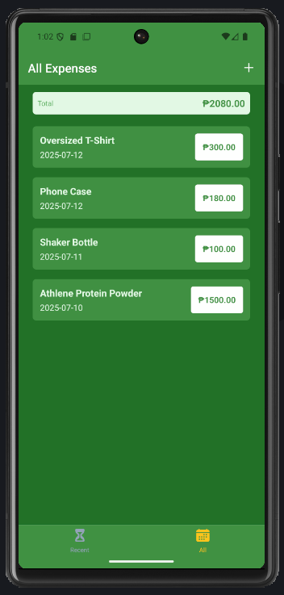
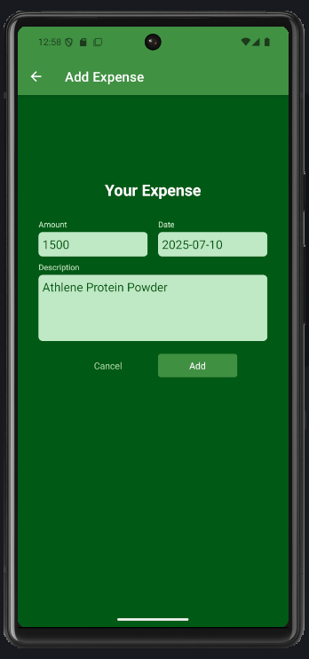
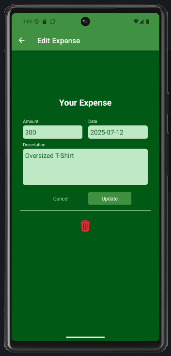

# 💰 Expense Tracker

A comprehensive React Native application for tracking personal expenses with real-time data synchronization using Firebase Realtime Database. Built with modern React Native, Redux Toolkit for state management, and Expo for seamless development and deployment.

## 📱 Screenshots

### Recent Expenses Screen



_View your expenses from the last 7 days at a glance_

### All Expenses Screen



_Complete overview of all your recorded expenses_

### Add New Expense



_Easily add new expenses with amount, date, and description_

### Update Existing Expense



_Edit or delete existing expenses with intuitive interface_

## ✨ Features

- **📊 Expense Tracking**: Add, edit, and delete expenses with ease
- **📅 Time-based Filtering**: View recent expenses (last 7 days) or all expenses
- **💾 Real-time Sync**: Data persisted using Firebase Realtime Database
- **🎨 Modern UI**: Clean and intuitive interface with smooth animations
- **📱 Cross-platform**: Works on both iOS and Android devices
- **⚡ Loading States**: Beautiful loading indicators for better UX
- **✅ Form Validation**: Input validation with error handling
- **🗑️ Delete Functionality**: Remove unwanted expenses with confirmation
- **🔄 State Management**: Powered by Redux Toolkit for predictable state updates

## 🛠️ Tech Stack

- **Frontend**: React Native with Expo
- **Navigation**: React Navigation (Stack & Bottom Tab Navigation)
- **State Management**: Redux Toolkit
- **Backend**: Firebase Realtime Database
- **HTTP Client**: Axios
- **Icons**: Expo Vector Icons (Ionicons)
- **Styling**: React Native StyleSheet with custom themes

## 📦 Dependencies

```json
{
  "@react-navigation/bottom-tabs": "^6.5.11",
  "@react-navigation/native": "^6.1.9",
  "@react-navigation/native-stack": "^6.9.17",
  "@reduxjs/toolkit": "^2.8.2",
  "axios": "^1.10.0",
  "expo": "~53.0.20",
  "react": "19.0.0",
  "react-native": "0.79.5",
  "react-redux": "^9.2.0"
}
```

## 🚀 Getting Started

### Prerequisites

- Node.js (v14 or higher)
- npm or yarn
- Expo CLI
- Android Studio (for Android development)
- Xcode (for iOS development, macOS only)

### Installation

1. **Clone the repository**

   ```bash
   git clone https://github.com/aaronersando/Expense-Tracker-App.git
   cd ExpenseTracker
   ```

2. **Install dependencies**

   ```bash
   npm install
   # or
   yarn install
   ```

3. **Set up Firebase**

   - Create a new Firebase project at [Firebase Console](https://console.firebase.google.com/)
   - Enable Realtime Database
   - Update the `BASE_URL` in `util/http.js` with your Firebase database URL

4. **Start the development server**

   ```bash
   npm start
   # or
   expo start
   ```

5. **Run on device/emulator**
   - For Android: `npm run android` or scan QR code with Expo Go app
   - For iOS: `npm run ios` or scan QR code with Expo Go app

## 📁 Project Structure

```
ExpenseTracker/
├── assets/                     # Images and screenshots
├── components/
│   ├── ExpensesOutput/         # Expense list components
│   │   ├── ExpenseItem.js
│   │   ├── ExpensesList.js
│   │   ├── ExpensesOutput.js
│   │   └── ExpensesSummary.js
│   ├── ManageExpense/          # Expense form components
│   │   └── ExpenseForm.js
│   └── UI/                     # Reusable UI components
│       ├── Button.js
│       ├── IconButton.js
│       ├── Input.js
│       └── LoadingOverlay.js
├── constants/
│   └── styles.js               # Global styles and theme
├── screens/
│   ├── AllExpenses.js          # All expenses screen
│   ├── ManageExpenses.js       # Add/Edit expense screen
│   └── RecentExpenses.js       # Recent expenses screen
├── store/
│   ├── expensesSlice.js        # Redux slice for expenses
│   └── store.js                # Redux store configuration
├── util/
│   ├── date.js                 # Date utility functions
│   └── http.js                 # API calls to Firebase
├── App.js                      # Main app component
└── package.json
```

## 🎯 Core Functionality

### Expense Management

- **Add Expenses**: Create new expense entries with amount, date, and description
- **Edit Expenses**: Modify existing expense details
- **Delete Expenses**: Remove unwanted expenses from the database
- **View Expenses**: Browse all expenses or filter by recent (last 7 days)

### Data Persistence

- All expenses are stored in Firebase Realtime Database
- Real-time synchronization across devices
- Offline support with local state management

### User Interface

- **Bottom Tab Navigation**: Easy switching between Recent and All expenses
- **Modal Screens**: Dedicated screens for adding/editing expenses
- **Loading States**: Visual feedback during API operations
- **Form Validation**: Input validation with error messages

## 🔧 API Endpoints

The app communicates with Firebase Realtime Database through the following operations:

- `POST /expenses.json` - Create new expense
- `GET /expenses.json` - Fetch all expenses
- `PUT /expenses/{id}.json` - Update specific expense
- `DELETE /expenses/{id}.json` - Delete specific expense

## 🎨 Design System

The app uses a consistent design system with:

- **Primary Colors**: Various shades of purple/blue theme
- **Typography**: Clean, readable fonts with proper hierarchy
- **Spacing**: Consistent padding and margins throughout
- **Icons**: Ionicons for consistent iconography
- **Animations**: Smooth transitions and loading states

## 🤝 Contributing

1. Fork the repository
2. Create your feature branch (`git checkout -b feature/AmazingFeature`)
3. Commit your changes (`git commit -m 'Add some AmazingFeature'`)
4. Push to the branch (`git push origin feature/AmazingFeature`)
5. Open a Pull Request

## 📄 License

This project is licensed under the MIT License - see the [LICENSE](LICENSE) file for details.

## 👨‍💻 Author

**Aaron Ersando**

- GitHub: [@aaronersando](https://github.com/aaronersando)

## 🙏 Acknowledgments

- React Native community for excellent documentation
- Firebase for reliable backend services
- Expo team for streamlined development experience
- Redux Toolkit for simplified state management

---

_Built with ❤️ using React Native and Firebase_
